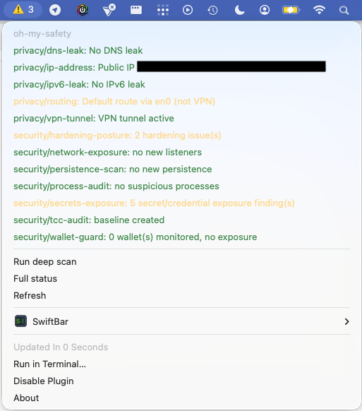

#  oh-my-safety

[](https://github.com/Vardominator/oh-my-safety/actions/workflows/ci.yml)
[](https://github.com/Vardominator/oh-my-safety/releases)
[](#install)
[](LICENSE)


**A one-stop safety monitor for your Mac.** oh-my-safety continuously verifies both your **privacy** (VPN / DNS / IP leaks) and your **security** (malicious persistence, suspicious processes, exposed secrets and crypto wallets, weak system hardening) — and it does so entirely on your machine. **Nothing is ever uploaded. No telemetry, no phone-home, ever.** ([verify it yourself](docs/privacy.md))

> Formerly **oh-my-privacy** — the VPN checks are now one category alongside a full set of security checks. Existing installs keep working; see [migration notes](#upgrading-from-oh-my-privacy).

```
$ oh-my-safety status
Last scan:  2026-07-15T15:04Z (12s ago)
  [ok]       privacy   routing        Default route via utun5 (VPN)
  [warn]     security  hardening      Firewall off; XProtect 47 days stale
  [critical] security  process-audit  unsigned binary in /tmp   [id: proc:/tmp/x]
  [skip]     security  tcc-audit      needs Full Disk Access
```

## Install

```bash
# Homebrew (recommended) — this repo is its own tap
brew tap vardominator/oh-my-safety https://github.com/Vardominator/oh-my-safety
brew install vardominator/oh-my-safety/oh-my-safety
brew services start oh-my-safety      # background monitoring, runs at login

# or the install script
curl -fsSL https://raw.githubusercontent.com/Vardominator/oh-my-safety/main/install.sh | bash
```

Zero dependencies — pure `/bin/bash` and tools that ship with macOS. (Tapping by
URL is needed because the tap lives in the main repo rather than a separate
`homebrew-*` repo.) See [docs/getting-started.md](docs/getting-started.md) for
`--HEAD` and other options.

## Quickstart

```bash
oh-my-safety scan          # run every check once and see findings
oh-my-safety status        # your current safety posture (reads the last scan)
oh-my-safety checks        # every check and whether it's on/off
oh-my-safety doctor        # setup, permissions, and a notification test
```

## What it checks

Everything is **on by default**. Turn any check — or a whole category — on/off:

```bash
oh-my-safety disable privacy          # e.g. you don't use a VPN
oh-my-safety enable  wallet-guard
```

| Category | Checks |
|----------|--------|
| **Privacy** | IP leak, DNS leak, IPv6 leak, VPN tunnel, traffic routing |
| **Security** | hardening posture (SIP/Gatekeeper/FileVault/firewall/XProtect), suspicious processes (incl. osascript password-phishing), launchd/login-item persistence, listening network services, crypto-wallet exposure, exposed secrets & SSH keys, TCC (Full Disk Access) grants |
| **Opt-in** | deep secret scan (gitleaks/trufflehog), YARA rules |

See the [full checks catalog](docs/checks/README.md) — one page per check explaining exactly how it keeps you safe.

## Responding to findings

When a check flags something, you can **fix it and confirm**, or **accept/ignore** it:

```bash
oh-my-safety recheck secrets-exposure                 # re-run after you fix something
oh-my-safety ignore  persistence-scan 'login|Foo'     # accept a specific item forever
oh-my-safety accept  network-exposure                 # "yes, that new listener is mine"
```

## Menu bar (optional)

Prefer an at-a-glance icon? Run the included [SwiftBar](https://swiftbar.app) plugin:

```bash
brew install --cask swiftbar     # if you don't already have SwiftBar
oh-my-safety menubar install     # installs the plugin and reloads SwiftBar
```

It's a thin renderer of `oh-my-safety status` — no scanning, no network — so the background agent stays the source of truth. 🛡️ = all good, ⚠️ = warnings, 🚨 = critical, 🌀 = stale/agent down.



See [docs/menu-bar.md](docs/menu-bar.md) for details.

## Documentation

Start at the **[documentation index](docs/README.md)**. Highlights:

- [Getting started](docs/getting-started.md) · [Configuration](docs/configuration.md) · [Continuous monitoring](docs/monitoring.md)
- [Privacy promise](docs/privacy.md) — every network endpoint, listed
- [Threat model — what we do and don't protect against](docs/threat-model.md)
- [Extending oh-my-safety with your own checks](docs/extending.md)
- [Architecture](docs/architecture.md) · [Roadmap](docs/roadmap.md)

## What it is (and isn't)

oh-my-safety is a **monitor and tripwire**, not an antivirus. It runs in userspace and polls, so it cannot see kernel rootkits or malware running as root that tampers with its own state. It complements — it does not replace — macOS's built-in Gatekeeper and XProtect (which is exactly why it checks that those are on and current). Read the honest [threat model](docs/threat-model.md) before relying on it.

## Upgrading from oh-my-privacy

The binary, config, and env-var prefix were renamed. A deprecation shim keeps `oh-my-privacy …` working, and your `~/.config/oh-my-privacy` config is migrated to `~/.config/oh-my-safety` automatically on first run. The old flags map to subcommands (`--once` → `scan`, `--list-checks` → `checks`).

## Contributing

New checks are drop-in files following a documented contract — see [docs/extending.md](docs/extending.md) and [CONTRIBUTING.md](CONTRIBUTING.md). License: MIT.
