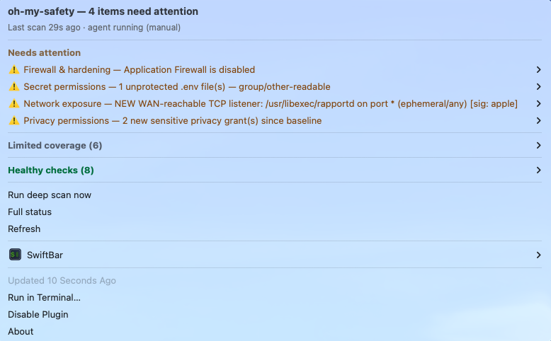
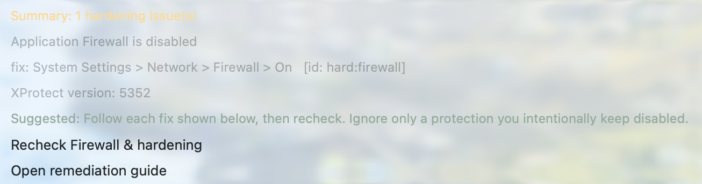

#  oh-my-safety

[](https://github.com/Vardominator/oh-my-safety/actions/workflows/ci.yml)
[](https://github.com/Vardominator/oh-my-safety/actions/workflows/distribution.yml)
[](https://github.com/Vardominator/oh-my-safety/actions/workflows/apt-repository.yml)
[](https://github.com/Vardominator/oh-my-safety/releases)
[](#install)
[](LICENSE)
[](docs/getting-started.md)
[](docs/linux.md)

**A local-first safety agent for macOS and Linux in an agentic world.**
oh-my-safety continuously verifies privacy, host hardening, persistence,
exposed credentials, suspicious processes, and other endpoint risks. Core
observation, scanning, correlation, and evidence stay on the machine. There is
no product telemetry or hosted collection service; optional internet exposure
and notification adapters disclose only their documented fields and are off by
default. ([verify it yourself](docs/privacy.md))

> Formerly **oh-my-privacy** — the VPN checks are now one category alongside a full set of security checks. Existing installs keep working; see [migration notes](#upgrading-from-oh-my-privacy).

```
$ oh-my-safety status
Last scan:  2026-07-15T15:04Z (12s ago)
  [ok]       privacy   routing        Default route via utun5 (VPN)
  [warn]     security  hardening      Firewall off; XProtect 47 days stale
  [critical] security  process-audit  unsigned binary in /tmp   [id: proc:/tmp/x]
  [skip]     security  tcc-audit      needs Full Disk Access
```

## Install

macOS:

```bash
# Homebrew (recommended) — this repo is its own tap
brew tap vardominator/oh-my-safety https://github.com/Vardominator/oh-my-safety
brew install vardominator/oh-my-safety/oh-my-safety
brew services start oh-my-safety      # background monitoring, runs at login
oh-my-safety doctor                   # verify permissions and notifications

# or the install script
curl -fsSL https://raw.githubusercontent.com/Vardominator/oh-my-safety/main/install.sh | bash
```

Linux packages are now published for `amd64` and `arm64`:

- Debian/Ubuntu: follow the fingerprint-verified
  [signed APT setup](docs/apt-repository.md#install-from-apt), then install
  `oh-my-safety` with `apt`.
- Fedora/RHEL or direct-package installs: follow the checksum-verified
  [native package steps](docs/linux.md#fresh-machine-native-package).

After installation:

```bash
oh-my-safety doctor
oh-my-safety scan --offline
oh-my-safety install-agent
```

See the [Linux guide](docs/linux.md) for prerequisites, release assets, and
systemd service management.

## Quickstart

The complete command set below is the v0.3.0 interface. The v0.2.3
compatibility release supports `scan`, `status`, `checks`, `doctor`,
configuration, finding handling, the launchd monitor, and SwiftBar.

```bash
oh-my-safety scan          # run every check once and see findings
oh-my-safety status        # your current safety posture (reads the last scan)
oh-my-safety history       # local scan, finding, and delivery timeline
oh-my-safety checks        # every check and whether it's on/off
oh-my-safety profile list  # personal, developer, managed, server, air-gapped
oh-my-safety doctor        # setup, permissions, and a notification test
```

## What it checks

Core privacy and security checks are **on by default**. Content-based secret and
YARA scans are opt-in because they require separately installed tools and trusted
local rules. Turn any check — or a whole category — on/off:

```bash
oh-my-safety disable privacy          # e.g. you don't use a VPN
oh-my-safety enable  wallet-guard
```

| Category | Checks |
|----------|--------|
| **Privacy** | IP leak, DNS leak, IPv6 leak, VPN tunnel, traffic routing |
| **Security (macOS)** | SIP/Gatekeeper/FileVault/firewall/XProtect posture, suspicious processes, launchd/login-item persistence, listening services, crypto-wallet exposure, secret/SSH-key permissions, TCC grants |
| **Security (Linux)** | LUKS/Secure Boot/firewall/SELinux/AppArmor/SSH/update posture, systemd/cron/autostart/shell persistence, secret/SSH-key permissions |
| **Bounded local** | built-in redacted credential scan and manual executable triage; opt-in gitleaks/trufflehog and trusted local YARA |
| **Opt-in internet exposure** | HIBP password k-anonymity and explicitly configured breached-account monitoring |

See the [full checks catalog](docs/checks/README.md) — one page per check explaining exactly how it keeps you safe.
Configuration precedence, the supported YAML subset, and copy-pasteable examples
are in the [configuration guide](docs/configuration.md).

Choose a security posture with [profiles](docs/profiles.md), and configure
native or opt-in SendGrid, Telegram, WhatsApp, Discord, or webhook delivery with
the [notification guide](docs/notifications.md). Offline and air-gapped
profiles enforce a network deny gate over every adapter.

For a self-hosted fleet, the organization controller provides one-use
enrollment, pinned signed policy, per-group check/cadence requirements,
redacted finding synchronization, roles, and an administrative audit trail.
Endpoints keep scanning while disconnected and the controller has no remote
shell capability.

## Responding to findings

When a check flags something, you can **fix it and confirm**, or **accept/ignore** it:

```bash
oh-my-safety recheck secrets-exposure                 # re-run after you fix something
oh-my-safety ignore  persistence-scan 'login|Foo'     # accept a specific item forever
oh-my-safety accept  network-exposure                 # "yes, that new listener is mine"
```

## Menu bar (optional)

Prefer an at-a-glance icon? Run the included [SwiftBar](https://swiftbar.app) plugin:

```bash
brew install --cask swiftbar     # if you don't already have SwiftBar
oh-my-safety menubar install     # installs the plugin and reloads SwiftBar
```

It's a thin renderer of `oh-my-safety status` — no scanning, no network — so the background agent stays the source of truth. Warnings show the exact finding, suggested remediation, recheck action, and guide; healthy checks stay collapsed. 🛡️ = all good, ⚠️ = warnings, 🚨 = critical, 🌀 = stale/agent down.

The at-a-glance overview keeps findings prioritized and healthy checks out of the way:



Each finding includes the saved details, a suggested fix, a one-click recheck, and its remediation guide:



See [docs/menu-bar.md](docs/menu-bar.md) for details.

## Documentation

Start at the **[documentation index](docs/README.md)**. Highlights:

- [Getting started](docs/getting-started.md) · [Linux](docs/linux.md) · [Configuration](docs/configuration.md) · [Continuous monitoring](docs/monitoring.md)
- [Profiles](docs/profiles.md) · [Notifications](docs/notifications.md) · [Local history](docs/history.md)
- [Self-hosted organization controller](docs/organization.md)
- [Signed offline intelligence](docs/offline-intelligence.md)
- [Privacy promise](docs/privacy.md) — every network endpoint, listed
- [Threat model — what we do and don't protect against](docs/threat-model.md)
- [Extending oh-my-safety with your own checks](docs/extending.md)
- [Architecture](docs/architecture.md) · [Roadmap](docs/roadmap.md)

## What it is (and isn't)

oh-my-safety is a defense-in-depth endpoint agent, not a replacement for an
EDR, antivirus, identity provider, backup, or OS security controls. Most shipped
collectors still run in user space and poll, so a privileged attacker can evade
or tamper with them. It reports missing permissions as missing coverage and
does not interpret “no findings” as proof that a machine is clean. Read the
honest [threat model](docs/threat-model.md) before relying on it.

## Upgrading from oh-my-privacy

The binary, config, and env-var prefix were renamed. A deprecation shim keeps `oh-my-privacy …` working, and your `~/.config/oh-my-privacy` config is migrated to `~/.config/oh-my-safety` automatically on first run. The old flags map to subcommands (`--once` → `scan`, `--list-checks` → `checks`).

## Contributing

New checks are drop-in files following a documented contract — see [docs/extending.md](docs/extending.md) and [CONTRIBUTING.md](CONTRIBUTING.md). License: MIT.
